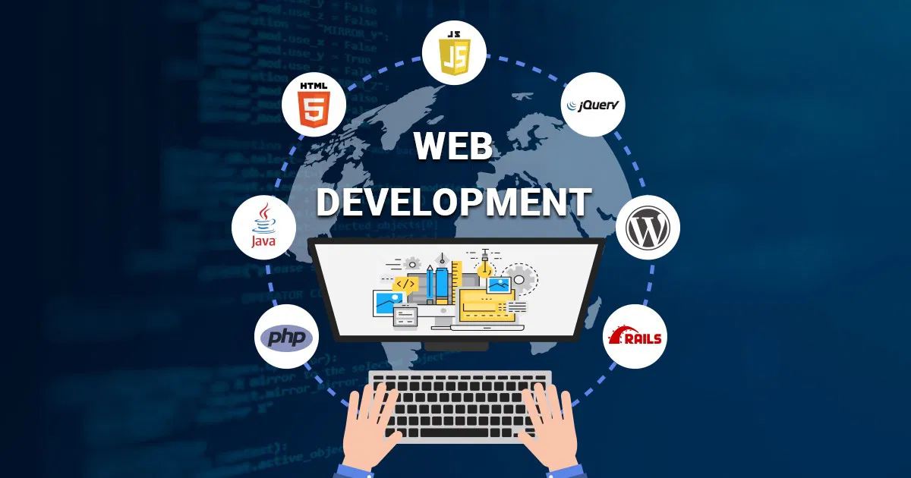

# Hello, I'm Uyen Vu (Welcome to My Profile) 👋
## Information Technology Student | Web File Trung Phat Trien

I am currently studying Information Technology at [School Name],
focusing on web development with HTML, CSS, JavaScript and PHP.

### Recent Projects
- [Portfolio Website](https://github.com/uyen-vu1907/portfolio-website): Build a personal website to host projects.
- MAMP Exercise: Configure a local web development environment.
- SSI Exercise: Use Server Side Added to create content.

### What I'm Learning
- HTML, CSS, JavaScript
- PHP and MySQL
- Git and GitHub
- Accessibility in web development

### Current Learning Objectives
- Improve accessibility skills for websites.
- Learn more about responsive design.

### Technical Skills
- Languages: HTML, CSS, JavaScript, PHP
- Tools: VS Code, MAMP, Git
- Concepts: Web development, database design, accessibility

### Skill Badges

### Contact Me
- LinkedIn: [Coming Soon]
- Email: [phuonguyenvudo@gmail.com]
- Portfolio: [Coming Soon]

### GitHub Stats

